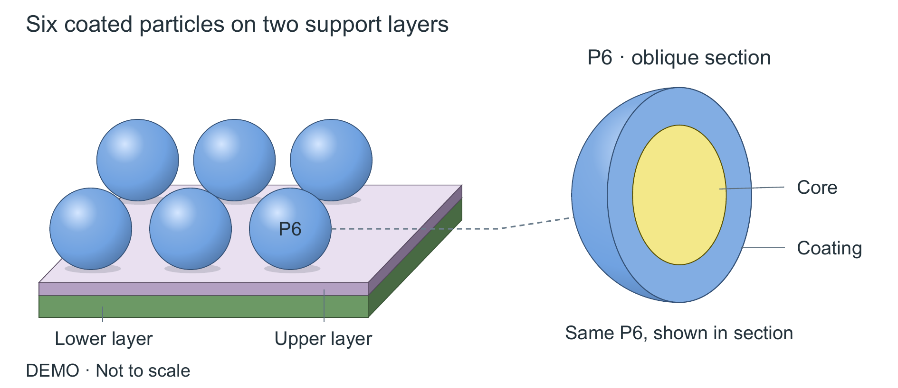
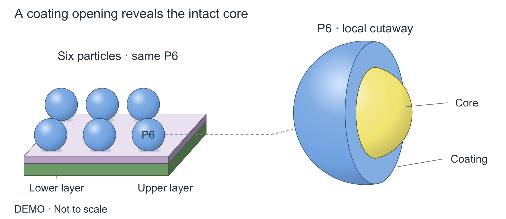

# FigureCraft｜科研绘图与配色

FigureCraft 根据科学对象、关系和数据组织图形。它用于机制图、数组与寄存器图、分层材料、包覆与剖面、定量结果及整套论文配图，交付可编辑 SVG、矢量 PDF、PNG 和检查记录。

当前版本 **1.9.0**，调用标识 **`$scientific-figure-studio`**。论文修改与实际入稿可配合 [PaperCraft](https://github.com/zlsjtj/PaperCraft)。

## 本版的实际变化

明确区分修复与重设计：要求明显升级时，先生成能解释不同关系的候选，按同一入稿尺寸看作品，再判断保留或重画。保留事实与有效解释，不默认冻结旧布局。参考图主要学习共同对象、边界、局部对应和阅读顺序。

新增 [双通道光学读出示例](examples/optical-readout/README.md)。一套装置连接两条光路与同一快门的状态，避免把所有对象画成相同流程卡片；源文件、两种文字叙事和可搬移的重建命令一并提供。


`compare_designs.py` 新增 `--placement-width-mm`，让对照页固定相同宽度并报告有边界的字号换算。浏览器的 CSS 毫米不是校准过的实体尺规，最终仍需检查论文 PDF。

## 其他示例

以下是原创结构示意，包含六个包覆颗粒、两层支撑和同一颗粒的局部视图。尺寸为示意值，不表示实验结果。





A 同时切开涂层和内核；B 只打开涂层，保留内核曲面。两者使用不同几何，局部放大不会算成新增颗粒。[源脚本](examples/material-polished-v17/build_material_v17.py)与导出的 SVG 均可编辑。这是矢量 2.5D，不是三维实体仿真。

## 安装与调用

```powershell
$skillRoot = if ($env:CODEX_HOME) { Join-Path $env:CODEX_HOME 'skills' } else { Join-Path $env:USERPROFILE '.codex/skills' }
New-Item -ItemType Directory -Force -Path $skillRoot | Out-Null
git clone https://github.com/zlsjtj/FigureCraft.git (Join-Path $skillRoot 'scientific-figure-studio')
```

已有同名目录时先备份。在新会话中显式调用，例如：

> 使用 $scientific-figure-studio 重画这张机制图。先核对对象、关系和数量，再设计构图与语义配色。按 160 mm 入稿宽度检查字号，保留源文件，给出实际前后对照和未解决项。

160 mm 只是这个例子的目标尺寸，应按实际版式调整。只换色的请求会锁定内容和布局；重设计可以改变构图，但不能擅自补科学机制或测量值。

## 运行示例

需要 Python，以及自己提供的可用字体。PNG 导出需要 Poppler 的 `pdftoppm`；字体和原生工具不随仓库分发。

```powershell
python -m pip install -r requirements-core.txt
$figureFont = (Join-Path $env:WINDIR 'Fonts/arial.ttf')
$figureCjk = (Join-Path $env:WINDIR 'Fonts/msyh.ttc')
$figureRaster = (Get-Command pdftoppm).Source
python scripts/probe_runtime.py --font $figureFont --cjk-font $figureCjk --pdftoppm $figureRaster --out runtime.json
python examples/material-polished-v17/build_material_v17.py --out material-source
python scripts/render_figure.py material-source/scene_A.json --out material-A --font $figureFont --pdftoppm $figureRaster --qa-views
python scripts/check_figure.py material-A --placement-width-mm 160
```

命令在仓库目录执行，输出目录应为新目录。其他系统替换成实际字体及工具路径。`--qa-views` 输出灰度和选定色觉模拟，仍需看图；字体覆盖以实际文本为准。Windows 的 Arial 不覆盖所有数学符号，含下标的测试使用 Segoe UI。

渲染器接收场景 JSON，不直接从自然语言推断科学关系。新图先读材料、确定结构，再编写场景或沿用已有绘图代码。接口见[场景规格](references/figure-spec.md)和[对象组件](references/scene-components.md)。

已有 SVG 可直接使用 `audit_svg_labels.py`，不必改成场景 JSON。它检查实际字号、有限直线穿字和声明的标签区域；CSS、曲线等未覆盖内容仍待审，见[使用方法](references/existing-svg-review.md)。

## 检查与复用

```powershell
python tests/run_all_tests.py --out test-output/core --font (Join-Path $env:WINDIR 'Fonts/segoeui.ttf') --cjk-font $figureCjk --pdftoppm $figureRaster
python tests/run_svg_label_tests.py --out test-output/svg-labels --font $figureFont --bold-font (Join-Path $env:WINDIR 'Fonts/arialbd.ttf')
```

八组回归共 138 项，加上已有 SVG 标签检查 17 项，共 155 项，覆盖数量、状态、连线方向、尺寸、剖面、开口、只换色范围以及失败状态传播。结果见[验收记录](provenance/acceptance-v1.9.md)。

技术检查、科学内容审阅和视觉审阅分别报告。`status` 是旧技术状态字段；判断完整状态应看 `overall_status`。缺少科学或视觉审阅时保留 `REVIEW_REQUIRED`，脚本不会替作者确认图片。

`examples/` 包含独立场景和示意数据，`templates/` 提供语义契约及审阅模板。重复局部图、装饰面和图例绑定原对象；量化图保持二维。主标签按实际尺寸以 9–10 pt 为起点，小于 8 pt 的情况需要修复或注明。

## 来源与边界

当前支持有限可检查的矢量 2.5D，不能自动证明科学含义，也不覆盖任意三维实体、所有 PDF 编辑器和全部色觉条件。每次改图仍需检查最终入稿页面。

PDF 字号检查器来自固定版本的 nature-skills，原始许可证和 NOTICE 保留在 `vendor/`，其他来源见[来源说明](provenance/upstream-sources.md)。参考截图和字体未随仓库发布，配色标注不代表任何期刊的官方规范。许可状态见 [LICENSE.md](LICENSE.md)。

公开仓库保留当前通用代码、示例和测试；本机路径、私人论文、完整代理日志和重复历史输出留在本地归档。
