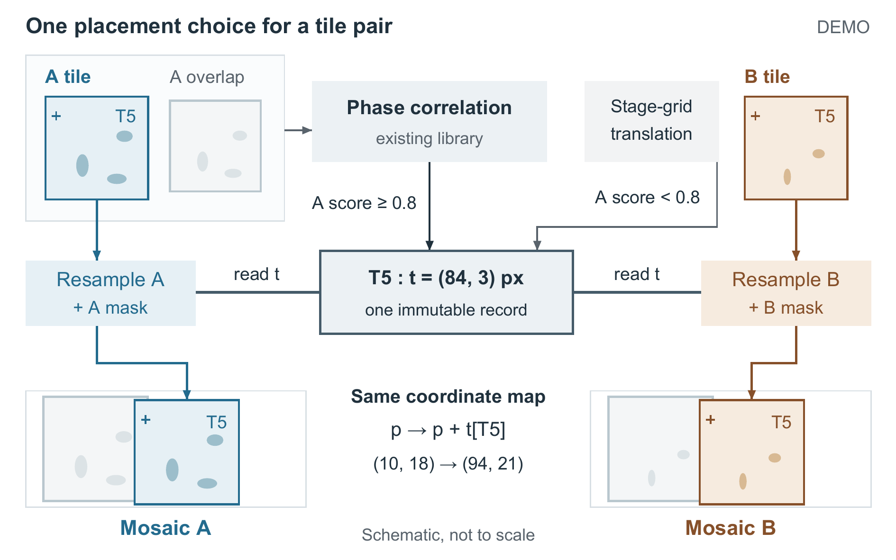
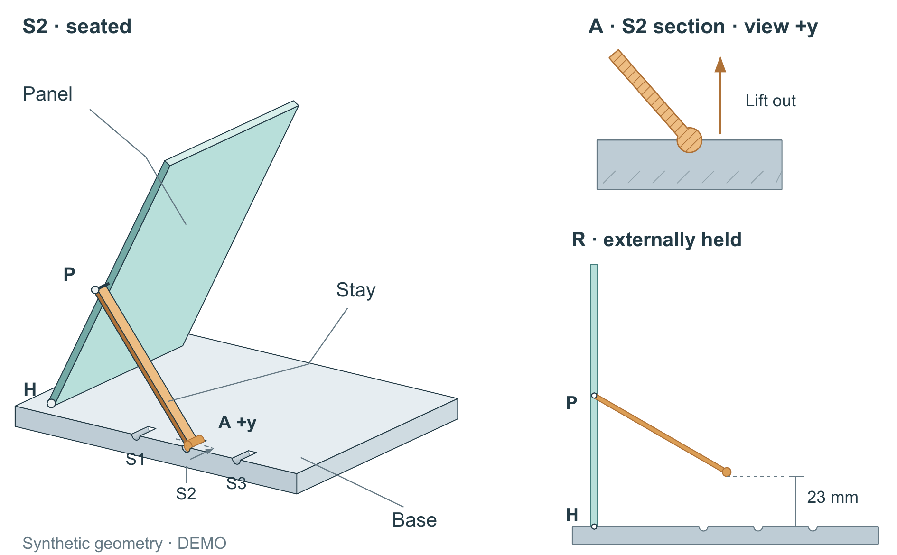

# FigureCraft｜科研绘图与配色

把研究中的结构、动作和关系画清楚。用于 Codex 的科研绘图 skill，提供可修改的图源和用于论文的导出文件。

[看前后对照](#从处理流程转向对象变化) · [开始使用](#开始使用) · [历史版本 1.27.1](https://github.com/zlsjtj/FigureCraft/releases/tag/v1.27.1) · [论文精修 PaperCraft](https://github.com/zlsjtj/PaperCraft)


三层材料共同卷绕。主体交代连续结构，尾端局部露出层序，颜色始终对应同一层。[查看输入、源码和其他构图](examples/co-wound-laminate/README.md)。本页均为原创构造示例，不代表实验结果。

[32 秒看一次构图修改与最终文件](docs/quick-tour/tour.gif) · [静态逐步版与源码链接](docs/quick-tour/README.md)

## 从处理流程转向对象变化

两路图像使用同一份放置记录。原图把计算、分支和重采样都放在主画面；改图让输入与放置后的对象上下对应，共用记录留在中间。读者可以直接追踪“哪个对象去了哪里”。

<table>
<tr><th width="50%">原图：处理步骤占据主体</th><th width="50%">改图：输入与结果直接对应</th></tr>
<tr>
<td><a href="examples/paired-placement/before/figure.png"></a></td>
<td><a href="examples/paired-placement/selected/figure.png"></a></td>
</tr>
</table>

两张图都按 **160 × 100 mm** 设计，标签没有缩小。无箭头支线表示读取同一记录，箭头表示重采样；部分选择规则和限定转入图注。上面是缩略预览，点击可看原图。[完整对照、图注和重建方法](examples/paired-placement/README.md)

## 不同的问题，用不同的画法



这个支架需要说明的是“撑杆脚可以从开放槽中抬离”。整体图保留装配关系，剖面露出接触方式，释放状态显示间隙。[两种构图的选择过程与源码](examples/display-support-contact/README.md)

机制图、材料结构、硬件连接和定量结果有不同的表达任务。空间感用于解释形体与遮挡；数据图保留准确的尺度、单位和不确定性，不用透视制造差异。更多例子：[包覆与剖面](examples/material-polished-v17/) · [共享参考](examples/common-reference-demo/README.md) · [箱角解锁](examples/bin-latch/README.md)。

## 开始使用

在可以读写本地文件的 Codex 环境中使用。安装前请查看[许可说明](docs/licensing.md)，已有同名技能目录时先备份。

用 PowerShell 安装当前默认分支，包含 MIT 许可证：

```powershell
$skillRoot = if ($env:CODEX_HOME) { Join-Path $env:CODEX_HOME 'skills' } else { Join-Path $env:USERPROFILE '.codex/skills' }
New-Item -ItemType Directory -Force -Path $skillRoot | Out-Null
git clone https://github.com/zlsjtj/FigureCraft.git (Join-Path $skillRoot 'scientific-figure-studio')
```

也可以[下载当前源码 ZIP](https://github.com/zlsjtj/FigureCraft/archive/refs/heads/main.zip)，解压后将仓库文件夹改名为 `scientific-figure-studio`，放入 `~/.codex/skills/`；设置了 `CODEX_HOME` 时使用它下面的 `skills/` 目录。

在新的 Codex 会话中附上原图或研究材料，然后这样说：

```text
使用 $scientific-figure-studio 重画这张机制图。
先判断读者最需要看懂的关系，再安排对象、连接和必要标签。
在科学含义不变的前提下，减少图内解释，让图形承担更多说明。
按 160 mm 入稿宽度检查，给我可编辑图源、SVG/PDF/PNG、图注和前后对照。
```

160 mm 是这个示例的目标宽度，可以换成你的论文版式。只有配色需要调整时，直接说明保留内容与构图即可。

读取材料和设计构图由 Codex 完成，导出需要 Python 依赖、字体和 Poppler。[依赖与可直接运行的示例命令](docs/usage.md)

## 拿到的文件

| 文件 | 用途 |
|---|---|
| Python / 场景文件 / SVG | 保留对象、布局、颜色和生成方式，便于继续修改 |
| PDF 与 PNG | 用于排版、预览和插入稿件 |
| 图注与前后对照 | 说明如何读图，以及这次改了哪些关系和标签 |

曲面示例可能采用“位图表面 + 矢量标签”的混合输出，表面要通过源码修改后重建；各示例会说明可编辑范围。字体和第三方原生工具需要自行提供。

## 使用边界与反馈

科学关系和数据以提供的材料为准。没有源数据时不会从低清曲线图中补造测量值；生成后仍需检查实际入稿页面。示例包含首次方案、修改和模型评阅，尚无真人审美认可的结论，也不代表任何期刊的官方风格。

如果某条连线容易读错，或某个标签入稿后太小，欢迎[提交 Issue](https://github.com/zlsjtj/FigureCraft/issues/new)，附上允许公开的示例和目标尺寸。请勿上传未获授权的论文或图片。

觉得这些图和源码有用，可以点个 **Star** 留作绘图参考。

[测试与检查](docs/usage.md#检查与复用) · [来源说明](provenance/upstream-sources.md) · [许可说明](docs/licensing.md)

自有代码、技能说明和原创示例采用 [MIT 许可](LICENSE)。第三方内容遵循各自许可，详见[许可说明](docs/licensing.md)。技能内容版本为 1.27.1；历史发布的文件清单对应其固定 Git 标签。
