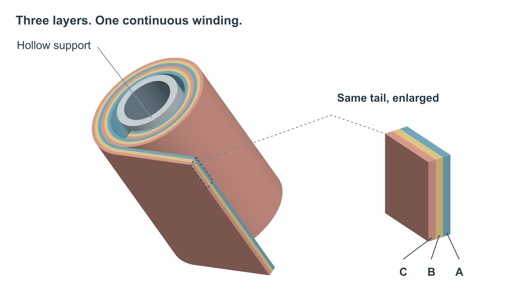
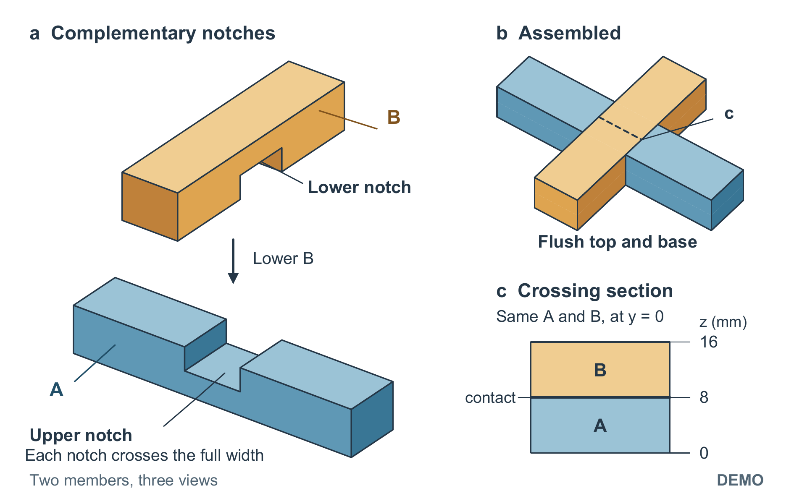
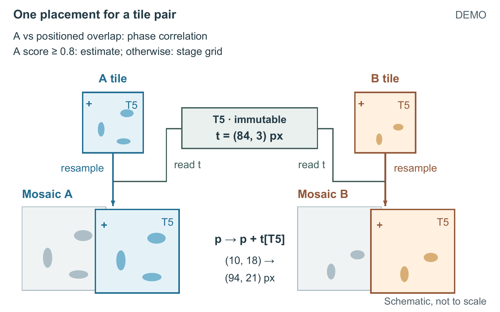

<p align="center">
  <a href="docs/social-preview/README.md"></a>
</p>
<p align="center"><a href="#作品与图源">看作品</a> · <a href="#开始使用">下载安装</a> · <a href="docs/examples.md">案例与源码</a> · <a href="LICENSE">MIT</a></p>

给 AI 研究助手使用的科研绘图技能。把研究材料变成**对象可辨、关系清楚、层次分明**的机制图与结构图，交付**可编辑源文件、SVG / PDF / PNG 和重建脚本**。从构图到语义配色，让画面承担解释。

## 作品与图源

[](examples/co-wound-editorial/README.md)

**一张图，连起整体与局部。** 三层材料共同卷绕，局部放大同一尾端；颜色追踪材料，曲面与端面交代层序，虚线说明两幅视图的对应。

**[打开完整案例](examples/co-wound-editorial/README.md)** · [可编辑源码](examples/co-wound-editorial/build_figure.py) · [SVG](examples/co-wound-editorial/selected/figure.svg) · [PDF](examples/co-wound-editorial/selected/figure.pdf)

<sub>原创结构演示。曲面为位图、标签为矢量；修改源码可重建曲面。</sub>

### 对象不同，画法也不同

<p>
<a href="examples/cross-lap-trial/README.md"></a>
<a href="examples/paired-placement/README.md"></a>
</p>

**[装配与剖面](examples/cross-lap-trial/README.md)**：用局部展开讲清互补缺口，沿剖切位置看装配结果。**[共享记录与对象变化](examples/paired-placement/README.md)**：用对象对应讲清变化，区分共同读取与重采样。

案例提供输入材料、首次方案、取舍和最终源码。以上均为原创构造示例。

## 开始使用

选择你使用的 AI 客户端，安装技能后交给它材料：

- **Claude 网页 / Desktop**：[下载技能 ZIP](https://github.com/zlsjtj/FigureCraft/releases/download/v1.28.1/scientific-figure-studio-claude.zip) · [导入说明](docs/install.md#claude-web)
- **WorkBuddy**：[下载技能 ZIP](https://github.com/zlsjtj/FigureCraft/releases/download/v1.28.1/scientific-figure-studio-workbuddy.zip) · [导入说明](docs/install.md#workbuddy)
- **Claude Code**：[插件安装，两条命令](docs/install.md#claude-code)
- **Codex**：[安装到技能目录](docs/install.md#codex)

**先画一张机制图：**[下载示例材料](https://github.com/zlsjtj/FigureCraft/releases/download/v1.28.1/scientific-figure-studio-first-use.zip)，解压后把 `TASK.md` 和 `input/` 交给客户端。技能 ZIP 保持压缩状态导入；示例材料 ZIP 解压后使用。

有自己的材料，可以直接说：

```text
使用 scientific-figure-studio，根据这份材料画一张机制图。
自行确定最需要看懂的关系，再选择构图。
保留必要标签、条件和单位；按 160 mm 图宽检查。
交付可编辑图源、SVG/PDF/PNG、图注和重建方法。
```

[完整使用教程](docs/first-use.md) · [安装与常见问题](docs/install.md) · [导出与运行依赖](docs/usage.md)

## 看图，也能带走源码

- [支架接触与释放](examples/display-support-contact/README.md)：把整体、接触局部和解除状态连起来。
- [离子交换示意](examples/exchange-granularity/README.md)：用局部变化解释大量重复单元。
- [从材料到构图](docs/from-materials-to-paper.md)：保留什么、放进图注什么，以及怎样选择方案。

[完整作品集](docs/examples.md) · [32 秒作品导览](docs/quick-tour/tour.gif)

## 下一张图，一起画好

欢迎[带一张难画的图来提 Issue](https://github.com/zlsjtj/FigureCraft/issues/new?template=usage.yml)：附允许公开的材料、目标尺寸，以及你希望读者看懂的关系。

**觉得作品和源码有用，点个 Star，留作下次画图的参考。** 论文叙事可搭配 [PaperCraft](https://github.com/zlsjtj/PaperCraft)。

[转发这个案例](docs/from-materials-to-paper.md) · 原创部分采用 [MIT](LICENSE)；[第三方许可](docs/licensing.md)、[实现与验证记录](docs/client-entry-validation.md)另列。
