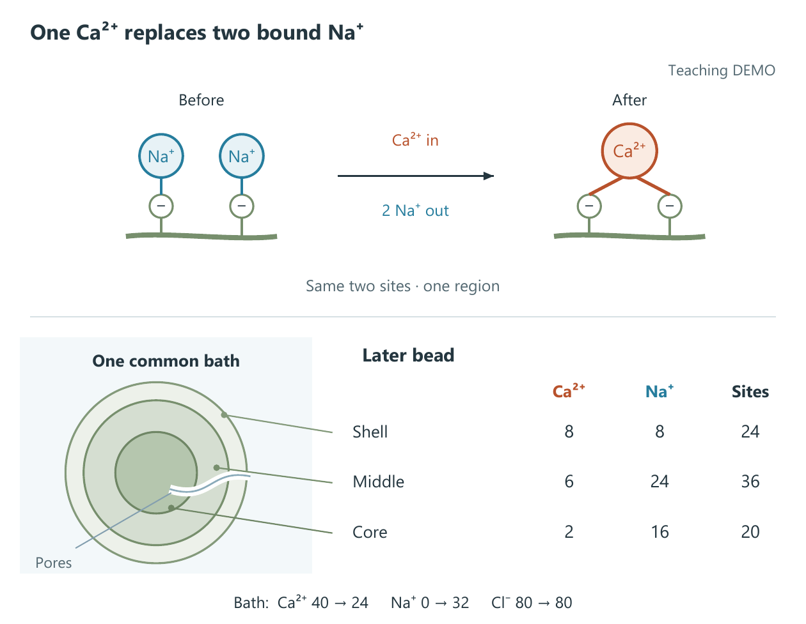

# 按读图问题选案例

以下均为原创构造示例，不是实测科研结果。三个例子用不同画法回答不同问题，保留可修改源码与落选方案。

## 共用了什么，分别发生了什么？

**两路图像放置。** 把对象变化放在主体，共用记录放在中间。无箭头支线表示共同引用，箭头表示重采样。160 × 100 mm，标签没有通过缩小来减少拥挤；图注承担更多条件说明。

[前图](../examples/paired-placement/before/figure.png) · [构图取舍、图注和源码](../examples/paired-placement/README.md) · [用原始材料试一次](first-use.md)

## 连续结构怎样展开，又不被误读为另一个对象？

**三层共同卷绕。** 主体交代连续结构，同一尾端角部露出层序。三层颜色保持身份，放大视图不是新增一组材料。160 × 95 mm；曲面为位图、标签为矢量，曲面通过源码重建，不冒称全矢量。

[输入与两种构图](../examples/co-wound-editorial/README.md) · [源码](../examples/co-wound-editorial/build_figure.py) · [PDF](../examples/co-wound-editorial/selected/figure.pdf)

## 重复单元很多，怎样保留数量又不画满小字？

**离子交换。** 一处局部结构解释两个位点的关系，区域数表保存全部构造数量。采用机制优先的版本；另一个版本先讲区域占用，比较份额更直接，但主机制不够突出。

[两种完整候选与重建](../examples/exchange-granularity/README.md) · [原始条件](../examples/exchange-granularity/inputs/mechanism_brief.md) · [可编辑 SVG](../examples/exchange-granularity/exchange-led/figure.svg)

这个例子不适合必须检查每个位点身份与邻接关系的任务，也不是带误差线的统计图案例。不要把局部加数表套到所有图上。

三例证明的是已有公开作品及其可检查的选择过程，不代表所有领域都会得到同样效果。对照时请打开原尺寸 PDF；网页缩略图适合选例子，不代替入稿检查。

想看普通提示与技能各自得到和失去什么，可看[新材料对照与评后修正](../examples/cross-lap-trial/README.md)。首评没有要求技能胜出，模型评阅与真人体验分开记录。
