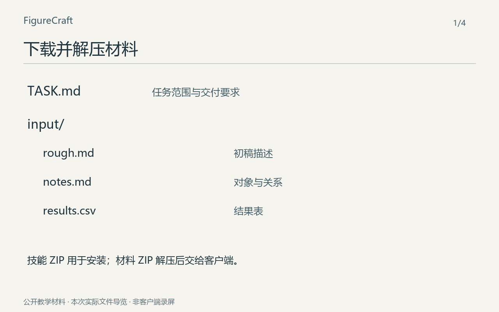

# 从下载包到成品：一次完整试用

先跟着做一个小任务，再决定怎样用在自己的研究里。这里的材料和成品都可以下载。

[](tour.gif)

[逐步看静态图](frames/) · 点击动图可打开大图。

动图由本次输入和实际导出文件编排，是操作导览，不是客户端录屏，也不表示实际生成耗时。材料与数值均为教学构造。

## 1. 准备材料

[下载公开试用包](https://github.com/zlsjtj/FigureCraft/releases/download/v1.28.1/scientific-figure-studio-first-use.zip)，解压得到 `TASK.md` 和 `input/`。先按[安装说明](../install.md)启用技能；技能包用于安装，材料包用于这次任务。

本地客户端打开任务文件夹；使用附件的客户端同时提供 `TASK.md` 和 `input/` 中的文件。原始文件也保存在[这里](input/)。

## 2. 发出任务

```text
使用 FigureCraft（scientific-figure-studio）。
按 TASK.md 处理 input/ 中的材料，
将结果另存到 output/，保留原文件。
```

等待客户端完成材料阅读、构图、图源生成、导出和检查。材料准备脚本只复制输入，不会自动调用模型。新任务会得到自己的生成结果，不要求与下面的源码逐字相同。

## 3. 打开成品

[SVG 图源](output/figure.svg) · [PDF](output/figure.pdf) · [PNG](output/figure.png) · [英文图注](caption.txt) · [重建源码](build_figure.py)

左侧只保留一个位移记录，中间是同一 tile 的 A、B 两平面，右侧是各自的输出。无箭头分支表示共同引用，单向箭头表示分别重采样；相同位移落到两个可见对象上。

## 4. 对照自己的结果

按 160 × 100 mm 导出；最小字号约 9.1 pt。实际几何对应同一 (84, 3) px 位移，标记点均从 (10, 18) 到 (94, 21)。查看了正常色、灰度及一种色觉模拟。平面按逻辑分行，不表示仪器物理位置；门限、掩膜、缺对与残余光学位移限制由图注承接。

本次自修：首稿输出边界比声明坐标原点高了 3 个绘图单位；对齐后重新计算两组实际图元位置，再导出选稿。

先检查对象、连线和颜色是否表达了正确关系，再调整画法。想继续修改时，指出具体文件与问题，例如“这个标签到底属于哪一个对象”或“两个输出能否看出复用了同一位移”。

## 重建这次成品

下面重建已经写好的补丁或图源，不是再调用模型。在仓库根目录运行，输出必须是新路径；依赖见[运行说明](../usage.md)。

```text
python docs/first-run/build_figure.py --skill . --input docs/first-run/input --out ../figure-rebuilt.json
python scripts/render_figure.py ../figure-rebuilt.json --out ../figure-rebuilt --font PATH_TO_FONT --cjk-font PATH_TO_CJK_FONT --pdftoppm PATH_TO_PDFTOPPM --qa-views
```

这次在 Codex 桌面当前会话中读取公开下载包完成，由维护模型审阅。材料此前已有案例，因此不是陌生材料盲测；也不是 Claude / WorkBuddy 客户端实录。来源、文件内容标识和检查范围见 [run.json](run.json)。原先候选保存在 [retained](retained/)。

[不播放动图，逐步看静态图](frames/) · [回到首次使用说明](../first-use.md)
