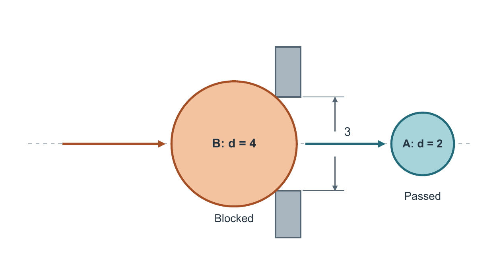

# 固定开口：从流程说明到少字机制图

这个独立示例展示如何让同一个开口的几何关系承担解释，再把规则和验证细节分配给图注、正文。它是构造 DEMO；无需其他技能或原工作目录即可查看、重建和检查。



先看 [brief.md](brief.md) 的科学事实，再比较 [baseline](exports/baseline/figure.png)、[首轮](exports/first/figure.png) 和[最终候选](exports/final/figure.png)。三图均为 160 × 84 mm。baseline 根据文字描述重建，首轮保留真实出现过的文字冲突；没有用修正图冒充首次产物。

读者应能看到：B 比开口高，轮廓抵住两角并留在左侧；A 比开口小且在右侧。最终图不增加新机制，只让原有主关系更容易辨认。完整规则、实际减字与代价见 [review.md](review.md)；图注见 [caption.md](caption.md)。

## 文件

- `source/baseline.json`、`first.json`、`final.json`：三版可编辑场景输入。
- `exports/baseline/`、`first/`、`final/`：每版 SVG、矢量 PDF、PNG；最终版另有灰度和一种色觉模拟。
- `figure_spec.json`：对象、方向、锁定数值、身份、文字预算、单位和范围。
- `scripts/rebuild.py`：显式接收输入、输出、字体与 Poppler 路径，拒绝覆盖已有输出目录。
- `scripts/audit.py`：从实际最终 SVG/PDF 检查 17 个有限条件，不评价美感。
- `audit/`：几何检查、实际文字负载和审阅范围；`manifest.sha256.json` 绑定整理后的公开文件。

## 重建

本示例实际验证使用 Python 3.12，需要 [requirements.txt](requirements.txt) 中的库、Arial regular/bold 和 Poppler `pdftoppm`。字体不随示例分发。SVG 使用 Arial；替换字体后需重新检查布局，不能沿用原视觉判断。

将本目录复制到任意新目录，然后从任意工作目录执行。下列大写名称是由使用者填写的实际路径，`NEW_OUTPUT` 必须尚不存在：

```text
python EXAMPLE/scripts/rebuild.py --input EXAMPLE/source/final.json --out NEW_OUTPUT --font ARIAL_TTF --bold-font ARIAL_BOLD_TTF --pdftoppm PDFTOPPM
python EXAMPLE/scripts/audit.py --figure-dir NEW_OUTPUT --out NEW_AUDIT_JSON
```

把 `final.json` 换为 `baseline.json` 或 `first.json` 可重建对应版本。几何 audit 针对机制图最终候选，不用于五框 baseline。整理时已实际复制公开脚本与输入至包外新目录，并从不同 cwd 重建；三版共 15 个导出文件与原件 SHA-256 一致，重建结果未放入技能包。

## 检查边界

原产物已实际查看正常色、灰度和 Machado 2009 deuteranomaly severity 100 单条件模拟；这些是绘图代理自审，不是人类阅读实验、作者认可或完整色觉认证。最终图的 XML、几何、PDF 与渲染 PNG 已检查。浏览器 SVG 显示未验证；不把 PDF 渲染当浏览器截图。重建是路径与依赖检查，不是又一次自然语言生成试用。

SVG 由独立图元和文字组成，PDF 嵌入字体子集，PNG 为位图。所有导出图原样收录，整理没有重新设计图形。原始运行环境日志不属于这个公开示例。
