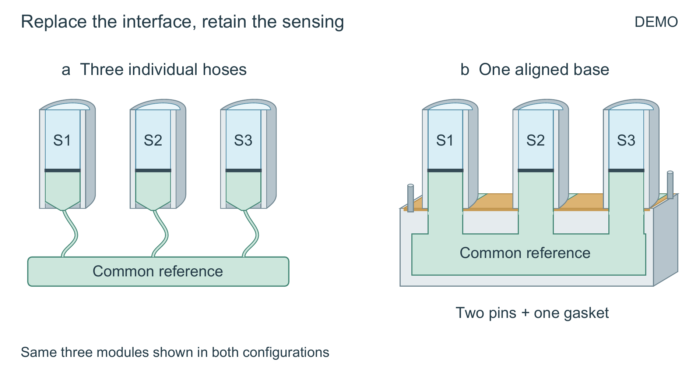

# 从装置剖面到论文真正改变的接口

原创合成 DEMO，不是实物设计或测量。原始材料见 [implementation.md](input/implementation.md)；完整论文示例仍在 [complete-fixture](../complete-fixture/README.md)。这个开发例只检验图形表达。



三只样品彼此隔离，通过闭合隔膜面对同一参考腔。一片垫密封三个参考口，两根销对正底座。来源没有提供销孔或机械公差，因此不画这些细节。

## 为什么选这一种

开发最初关注旧平面图的造型：它可以清楚表示连通腔，却把单片垫切成四个色段。组装斜剖确实让垫的连续后部可见，壳体也有了连续轮廓，但回到全文后，主编辑指出它仍主要解释继承的“共同参考”，没有让读者看见本文改变的“接口替换”。这个指引在技能中本来就有；此次委托和执行聚焦过窄，不能把遗漏归因成又缺一条规则。

最后选用同样160×85mm的前后对照：两侧的样品、隔膜、模块位置和共同参考不变，左侧三条软管与右侧一个底座直接对应。移除了重复的上方副题及左下方总结，保留一次“同三模块重复展示”的身份提示。图注承接非比例、示意壳体及卸压条件。更丰满的单装置剖面被保留为 [object-view](views/object-view/figure.svg)，但不再作为这篇稿的主图。

| 实际候选 | 得到什么 | 问题与处置 |
|---|---|---|
| [组装首稿](views/first/figure.png) | 共同参考和整片垫可见 | 垫悬空，未与底座接触；已修。不能把技术 PASS 当作关系正确。 |
| [展开首稿](views/alternative/figure.png) | 尝试显露垫与端口对应 | 模块分开后参考颈仍延伸，错误暗示持续连接；标题拥挤。淘汰，不作可用图。 |
| [装置剖面](views/object-view/figure.svg) | 同一接触面、连续壳体、开放参考颈、闭合隔膜 | 单看装置关系可用，但全文层面没有突出本研究改变。 |
| [最终接口对照](views/selected/figure.svg) | 实际新增的连接方式与继承的传感关系同时可查 | 同样画布内重复展示三模块，壳体比单图小；销的未知配合细节仍不显示。 |

精修中完整后壳一度遮住参考颈，薄的垫前缘也一度横穿开放端口，均实际修复。曲面和立体不是免费收益：新增表面必须重新核对遮挡与连通，不能依赖增加图注纠正画面。

最终画布160×85mm，最小设计字号约9.07pt。正常色、灰度与单条件色觉模拟已由模型查看，未作真人审美或期刊认可测试。这里记录的是开发后的有限改善，不证明独立新材料的生成稳定性。

## 重建

```powershell
python examples/assembled-cutaway/build.py --out NEW_OUTPUT --font FONT.ttf --pdftoppm PATH_TO_PDFTOPPM
```

默认运行 [author_interface.py](author_interface.py) 创建选定接口场景，再用技能渲染器输出可编辑 SVG、矢量 PDF 和 PNG。[author_geometry.py](author_geometry.py)保留先前装置剖面的构造过程。已有输出目录会拒绝覆盖。添加 `--include-rejected` 可重建两个已淘汰的历史方案；它们不能作为成品使用。此命令验证固定源码可重建，不是让模型从材料重新生成。

图元、空腔、切面、文字和实体身份都保存在 [selected.json](scenes/selected.json)，图注与替代文本在 `views/selected`。不分发字体。
