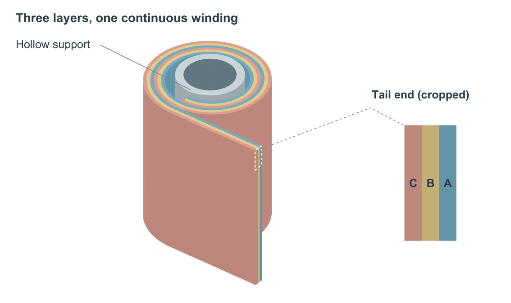

# 共卷层合带 从放大物体到显露关系

原创几何DEMO，无实测尺寸、材料性能或场量。三层共同卷绕两圈，再沿同一方向伸出。任务不是画三张漂亮薄片，而是让连续关系和层序在同一幅160×95 mm主图里可读。原始材料见[input.md](input.md)。



| 真实方案 | 得到什么 | 失去什么及选择 |
|---|---|---|
| 首稿 整体加相同视角的尾段 | 物体与局部同形，体积完整 | 局部放大后仍被外层遮住；三个标签挤在很窄的边缘。见first-continuous |
| 完整体加整圈端视图 | 卷绕路径更易追踪，适合核对圈数 | 两幅对象需合并理解，支承管省略与方位转换增加负担；本任务未选。见section-v2 |
| 完整体加尾端面裁切 | 主体保留连续关系，局部直接呈现三层相邻关系 | 不如整圈端视图方便检查所有螺旋路径；另需明确局部裁切。见selected |

选用图的局部来自同一网格的尾端面，只取轴向24至28这一段，再等比例投影。它不是加厚材料，也没有新增三层。初次局部标签仅写“End face”，引线停在标题附近，匿名模型审阅认为归属不够直接。最终补了主图选区、接到局部边界的引线和“Tail end (cropped)”标签。首稿和反馈前稿保留，不把反馈修复说成一次生成已完成。

同一个主视图可以漂亮但遮住需要解释的关系。先选能露出该关系的面，再整理色彩、标签与光照；不能把同一遮挡面放大后依赖更多说明。圆滑表面不是审美认证：本例有清楚的形体与层级，仍是原创结构示意，未经作者或真人审美认可。

## 重建

在仓库根目录运行，使用新输出目录：

```powershell
python examples/co-wound-laminate/build_laminate.py --out laminate-output --skill . --font C:/Windows/Fonts/arial.ttf --bold-font C:/Windows/Fonts/arialbd.ttf --pdftoppm <pdftoppm.exe完整路径>
```

加`--variant section`生成另一构图。依赖NumPy、Pillow、ReportLab与Poppler，使用本仓库`scripts/surface_renderer.py`。几何、相机、光照和标签均在Python源码；SVG/PDF是连续表面位图加矢量标签的混合文件，不是全矢量。表面修改后重建，不能在SVG里逐面编辑位图。导出记录包含实际表面分辨率、相机、源文件哈希和角色。灰度及一种近似色觉预览一并导出，不冒充完整色觉测试。

[清稿](document/clean.docx)、[PDF](document/clean.pdf)、[黄色稿](document/review.docx)与[前稿PDF](document/before.pdf)显示实际160 mm入稿。另需python-docx时可运行：

```powershell
python examples/co-wound-laminate/build_document.py --image laminate-output/figure.png --title "Co-wound layers on a hollow core" --body examples/co-wound-laminate/body.txt --caption examples/co-wound-laminate/caption.txt --out laminate-output/clean.docx
```
