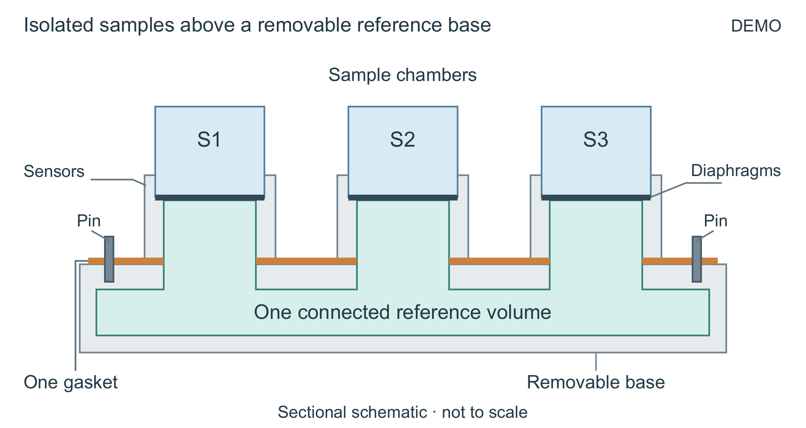

# 三腔压力夹具：从部件列表到关系剖面

这是原创合成DEMO，不对应真实装置或科研结果。输入文件保留原始英文材料与九条数据。生成者首次只得到材料、目标和候选技能，没有预写主旨或构图答案；随后一次自审。完整论文与表格收尾见 [PaperCraft完整示例](https://github.com/zlsjtj/PaperCraft/tree/main/examples/complete-fixture)。



## 选择与代价

- 原图仅列四类部件；剖面让三个样品彼此隔离、又通过封闭隔膜面对同一个参考空间的关系直接可见。
- [展开候选](alternative/figure.png)把底座拆开，更容易识别拆卸，但削弱了参考侧与隔膜的邻接关系，因此未选。
- [首次剖面](first/figure.png)主体已清楚，但密封垫引线穿过中央文字。[最终剖面](selected/figure.png)将它移到外围。没有靠配色变化冒充新构图。
- 最终图的定位销没有展开配合孔，定位作用仍需正文；单片密封垫在剖面中显示为多个断面，需要图注。这是当前表示的代价，不能声称机械装配细节全由图解释。

最终图的蓝色表示样品，绿色表示共同参考，橙色表示密封垫，深色线表示闭合隔膜。没有穿膜流动箭头。外形与尺寸仅为示意。这里平面剖面比装饰透视更直接；不把它当成所有科研图的默认模板。

## 重建

在仓库根目录执行。使用已安装依赖的Python，字体与Poppler由运行环境提供，不随仓库分发。

```powershell
python -m pip install -r requirements-core.txt
python examples/complete-fixture/build.py --font (Join-Path $env:WINDIR 'Fonts/arial.ttf') --pdftoppm (Get-Command pdftoppm).Source --out fixture-rebuilt
python scripts/check_figure.py fixture-rebuilt/selected --placement-width-mm 160
python vendor/nature-figure/audit_pdf_text.py fixture-rebuilt/selected/figure.pdf --min-pt 8 --json
```

每次使用新输出目录；`--selected-only`只重建选定版。编辑`scenes/*.json`中的独立对象可改变几何、标签和颜色；SVG可继续编辑。固定场景重建不证明技能又一次完成了自主设计。

## 实际验收

独立模型读完输入和最终正文，并看原图与最终PNG，没有发现已确认的数值或关系错误；共同参考与样品隔离更明确。最小字号约9.45 pt。原始九条数据、两次失败和NA留在论文中。正常色、灰度和一种近似色觉模拟已看，最终Word页面另经主编辑者查看。

未进行真人审美试验、真实打印、原生Word应用或机械验证。本轮没有普通提示/旧技能/新技能三组同期对照，也没有重复抽样；结论限于一次完整新上下文生成和随后的固定重建。
