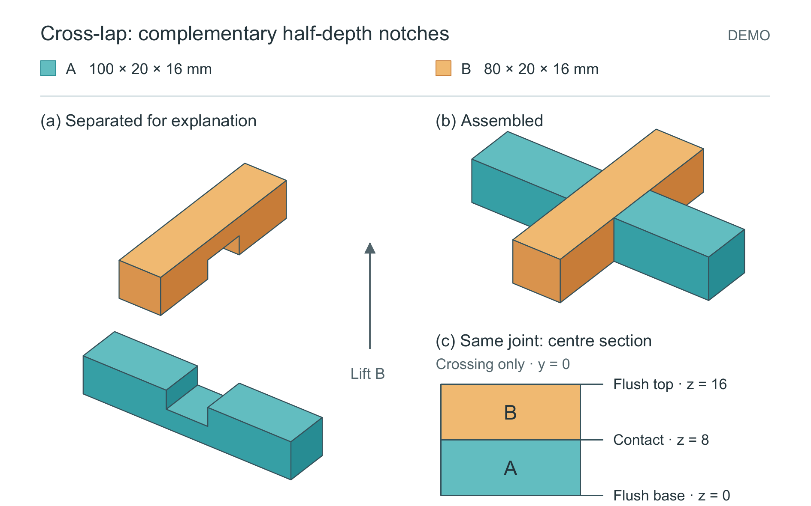
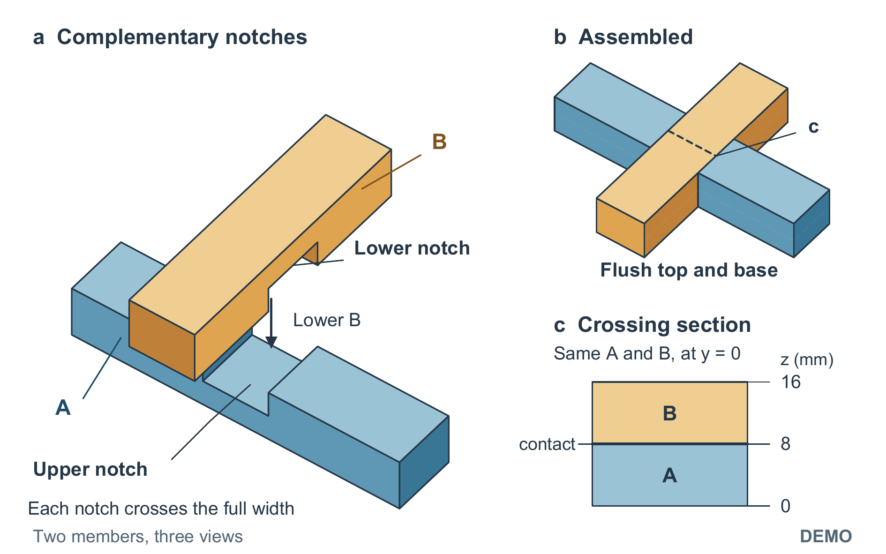

# 缺口看得清，装配关系也要跟得上

原创几何 DEMO：两个带互补半深缺口的构件交叉装配，中央不重叠，上下表面齐平。输入只有[尺寸与关系](input/structure.md)，没有指定构图。普通提示和 FigureCraft 在两个新模型上下文中分别生成，均为 160 × 100 mm、同一模型配置和一次自修机会。它不涉及实测接头、载荷或强度。

## 首轮比较没有全面胜者

| 普通提示 | FigureCraft 首轮定稿 |
|---|---|
|  |  |

[普通图 PDF](plain/figure.pdf) · [技能图 PDF](skill/figure.pdf) · [匿名模型首评](anonymous-review.md)

普通稿把构件拉开，独立缺口更容易辨认，但构件名称需查图例，剖面缺少定位线。技能稿的对象标签、装配动作和剖面对应更直接，左侧却有遮挡。首评先隐藏生成条件，未要求评审选赢家；[字母映射](condition-map.json)在首评后公开。没有真人审美认可。

## 评后怎样合并优点


[可编辑 SVG](selected/figure.svg) · [PDF](selected/figure.pdf) · [图注](selected/caption.txt) · [源码](selected/build_figure.py)

调整分解视图的观察角度和显示间隔，让两个缺口轮廓都露出来，继续保留直接对象标注、装配箭头与剖面定位。画布、标签文字和字号没有变化；图注也没有加长。退让是 A 缺口底面的投影变浅，未改的装配视图放大后仍有细小抗锯齿拼缝。

改图是收到首评后的开发成果，不能与普通首轮稿作公平胜率比较。首轮与评后稿都保留。现有技能已有“保留方案优势、修复障碍”的接续，本例检验该步骤是否落实，没有为这个形状新增通用规则或提高版本号。

## 从源码重建

在仓库根目录运行：

```text
python examples/cross-lap-trial/selected/build_figure.py --source examples/cross-lap-trial/input/structure.md --out ../cross-lap-rebuild --font /path/to/arial.ttf --bold-font /path/to/arialbd.ttf --pdftoppm /path/to/pdftoppm
```

将字体、Poppler 路径换成本机路径。需要 Python、ReportLab、Pillow、NumPy、pypdf。输出目录不得已有图件。所有图形均为矢量对象，SVG 文本依赖本地 Arial；字体不随例子分发。

`skill/build_figure.py` 使用同一命令并加 `--revision final`。`plain/build_figure.py` 的最小命令为：

```text
python examples/cross-lap-trial/plain/build_figure.py --out ../cross-lap-plain --font /path/to/arial.ttf --pdftoppm /path/to/pdftoppm
```

普通稿脚本仅把原来固定的本机路径改为参数，几何与构图未改。固定源码重建、新材料上的模型生成和真实读者理解是三种不同证据；本例有前两种及模型辅助复核，没有实物打印或真人测试。候选标识见 [candidate.json](candidate.json)，固定问题见 [questions.md](questions.md)。

[评后定向复验](postreview-check.md) · [最终文件与剩余取舍](final-file-check.md)
