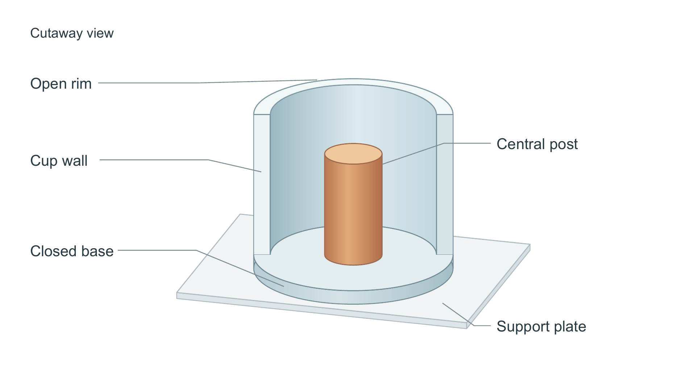

# 杯柱结构：从局部表面修整到完整构图

这是虚构结构演示，没有实验数据、测量尺寸或材料性能。输入仅规定杯、柱与板的几何关系，见 [input.md](input.md)。图宽160 mm，图内字体9–10 pt。



| 方案 | 能看清什么 | 取舍 |
|---|---|---|
| 首轮半杯剖开 | 柱与底的连接、柱低于杯口及周边空隙 | 底部双弧线重复，支承板较重。首稿保留在 `first_cutaway/`。 |
| 轴向截面 | 接触与空隙最明确，适合尺寸和壁厚讨论 | 环抱结构与空间体积被压成二维，本任务未选。见 `second_section/`。 |
| 最终半杯剖开 | 同一视图保留开口、厚壁、底部、中央柱和板 | 一次自审去除重复弧线、减轻支承板；仍有较长引线，包围感不如保留更多杯壁的旧作。 |

匿名代理比较倾向本图的主次与支承关系，但明确指出仍带有规整教材示意图气质。不是顶刊水准认证，也不是无反馈首稿成功。技术标签检查保留 `REVIEW_REQUIRED`：曲面、渐变和覆盖关系需要看图，不能强写通过。

## 从源码重建

在仓库根目录运行；输出必须是新目录。字体和 Poppler 由本机提供，不随仓库分发。

```powershell
python -m pip install -r examples/editorial-cup/requirements.txt
python examples/editorial-cup/draw_cup.py --out cup-output --input examples/editorial-cup/input.md --variant cutaway --font C:/Windows/Fonts/arial.ttf --bold-font C:/Windows/Fonts/arialbd.ttf --pdftoppm <pdftoppm.exe完整路径>
python examples/editorial-cup/build_pages.py --out cup-pages
```

第一条生成SVG、PDF、PNG及灰度/一种色觉模拟；改为 `--variant section` 可重建截面方案。`draw_cup_first.py` 是冻结首稿源码。图形全部是可编辑矢量路径与文字，渐变是外观线索，不是物理量或真实三维模型。

第二条从已归档的最终图和 `document-input.json` 重建清稿与黄稿。图源变化后，先将新导出绑定到该JSON再重建文档；不能把重建旧图当成新图入稿。Word转PDF用宿主文档工具实际渲染。

可直接查看 [清稿 PDF](documents/clean.pdf) 与 [黄色审阅稿](documents/review.docx)。两版均为1页，嵌入宽160 mm。文字黄标相对上一轮杯柱段落；只标新文案，不是 Word 原生修订。
