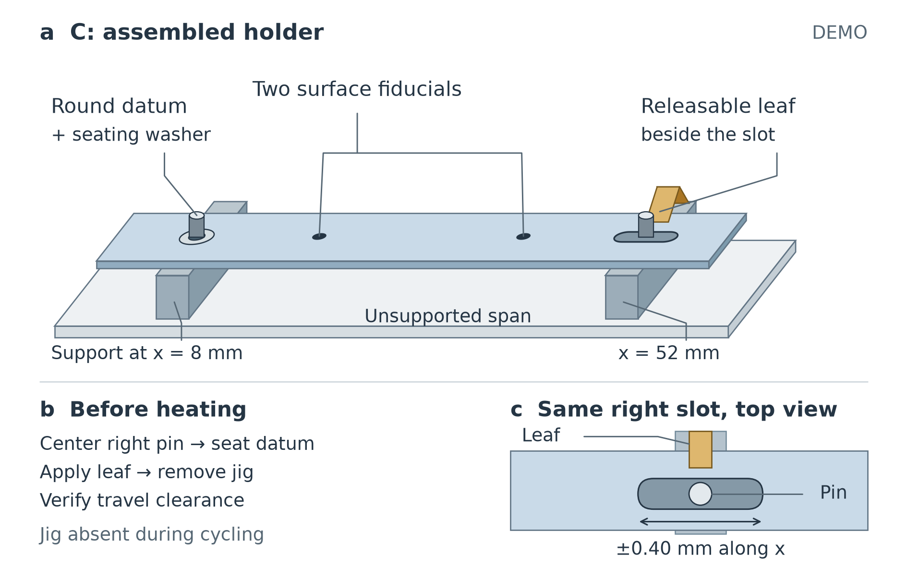
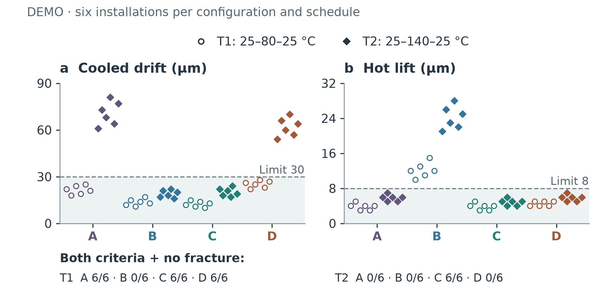

# Allowing Axial Travel While Seating a Strip for Repeated Thermal Imaging

*Constructed DEMO. All values and design records are fictional, fixed inputs for a research-editing demonstration; no experiment was run.*

## Abstract

Repeated thermal imaging asks a strip to return close to its initial position after cooling and remain seated while hot. We examine a releasable leaf added beside the slot of an inherited round-datum-and-slot fixture. Four configurations are compared using 48 constructed installation records under two heating schedules. Acceptance requires both cooled registration drift no greater than 30 µm and hot lift no greater than 8 µm, with no fractures. The leaf-retained configuration C meets both limits at both schedules. A slot without the leaf meets the drift limit but fails the height limit; locking C axially fails the drift limit at the higher temperature. The comparison supports a bounded assembly choice, without establishing a new locating principle or physical performance.

## The imaging requirement

Repeated heating raises a design question: how much longitudinal restraint can a holder retain while preserving image registration? Providing room for movement does not by itself keep the surface seated. These are separate requirements: displacement while hot is expected, whereas residual displacement after cooling impairs registration between repeated images. Height during the hot dwell matters to another part of image comparability. Passing only one criterion therefore cannot qualify a fixture. The comparison must therefore include conditions where a constrained holder already suffices.

Internal record R0 already contains the round datum and longitudinal slot. R1 supplies the microscope routine, heating stage, schedules and two-fiducial displacement estimator, previously used with screw-seated configuration A. The present DEMO examines the addition of a releasable leaf and its assembly checks, recorded in R2, together with the four-way comparison in R3. The components are conventional, and these constructed internal records cannot establish literature novelty.

## Separating the locating and seating roles

The opaque specimen is a 60 × 10 × 1 mm strip. Two narrow supports on one base lie at x = 8 and 52 mm; the central span is unsupported. A microscope above the strip observes circular fiducials at x = 20 and 40 mm on its centerline. Figure 1 shows configuration C: an upright left pin engages a round hole, with a washer keeping that datum seated. The right pin passes through a longitudinal slot that permits ±0.40 mm of strip travel relative to that pin, from the centered assembly position, and limits transverse movement.

A narrow leaf fixed to the right support presses on the strip beside the slot, leaving the opening visible. Its intended role is vertical seating while preserving axial allowance; it does not imply frictionless travel. The operator centers the right pin using a removable jig, seats the left datum, applies the leaf, removes the jig, then checks travel clearance with a feeler gauge. Leaving the jig inserted would constrain the intended motion.

Configuration A uses round holes and screw seating at both supports. B retains C's round datum and slotted geometry without downward leaf retention on the right. D starts from C and adds a screw that locks axial travel after indexing; C and D share the nominal leaf setting. These are configurations in separate trials, not simultaneous layers of an assembly.

Figure 1. Constructed DEMO assembly of C. One 60 × 10 × 1 mm strip rests on two supports above one base; the central span remains unsupported. The two surface marks are fiducials. The lower detail repeats the same right support in plan view and shows the leaf contact beside the unobstructed slot, with the pin centered before cycling. The ±0.40 mm label specifies permitted travel relative to the pin, not a measured displacement. Only the strip dimensions and stated locations are fixed; pin diameter, support cross-section and leaf shape are schematic. The centering jig is removed before heating. No optical path is depicted.

## Fixed comparison and measurement scope

T1 runs from 25 to 80 °C and back to 25 °C; T2 reaches 140 °C before returning. Both use a 2 °C/min ramp, a ten-minute hot dwell, and measurements after cooling to 25 °C plus another ten minutes. Each configuration has six separate installations per schedule, each undergoing three cycles. Every table row contains the maximum cooled drift, maximum hot lift and median hot axial travel over those three cycles. Installations, rather than individual cycles, are the plotted units.

Magnification, exposure, illumination and fiducial processing are shared. No registration correction precedes drift calculation, and the fixture does not digitally correct images. Empty-holder image drift spans 2–4 µm; this instrument check is neither subtracted nor used as an uncertainty interval. Trial order was not recorded as randomized. The application limits precede the demonstration, and Table 1 preserves all 48 records.

## What qualifies, and what fails

Figure 2 compares both limits directly. In T1, all six installations of A, C and D qualify. A's cooled maxima span 18–25 µm and its hot-lift maxima 3–5 µm. Thus the supplied low-temperature condition does not require C to meet the application limits. B's cooled maxima are only 11–17 µm, yet its hot lift spans 10–15 µm, so none of its installations qualifies.

T2 separates the configurations more sharply. B again passes the cooled-drift criterion, at 16–22 µm, while failing hot lift at 21–28 µm. C combines cooled drift of 17–24 µm with lift of 4–6 µm, qualifying in all six installations. A and D stay below the height limit but fail cooled drift: 61–81 µm for A and 54–70 µm for D. C is consequently the only configuration qualifying at both schedules; no fracture appears anywhere in the table.

Across T2 installations, the supplied per-installation median hot travel spans 0.22–0.25 mm for both B and C, compared with 0.05–0.07 mm for A and 0.04–0.06 mm for D. This distinguishes permitted hot motion from residual cooled drift. B versus C connects leaf retention with lower lift in these records; C versus D connects axial locking with failed cooled registration. Neither comparison supplies force, friction or stress measurements to establish the detailed mechanism.

Figure 2. Constructed DEMO values, with one marker per installation in each outcome panel. T1 and T2 use distinct symbols in separate horizontal lanes. Offsets separate overlapping markers and have no physical scale or installation-order meaning; their positions may differ between outcome panels. Each point is the maximum over that installation's three cycles, yielding six installations per configuration and schedule. Dashed lines show the separately specified 30 µm cooled-drift and 8 µm hot-lift limits; shaded regions meet the respective criterion. Qualification requires both criteria and no fracture. All 48 rows are retained in Table 1; no statistical intervals are implied.

## Assembly checks and conclusion

Separate staged checks found all six deliberately retained jigs and rejected all six deliberately insufficient clearances before heating. These checks exercise preparation gates, not field fault rates. Six room-temperature remove-and-reseat displacements for C were 9, 12, 8, 15, 11 and 13 µm. With no comparative reseating series, timing or long-term testing, they show neither faster setup nor lasting calibration.

Within the fixed DEMO, C combines axial allowance and vertical seating across both schedules. Its value is clearest where the higher-temperature comparison rejects the constrained alternatives and the unretained slot. Physical validation, stress characterization and service reliability remain unresolved.
