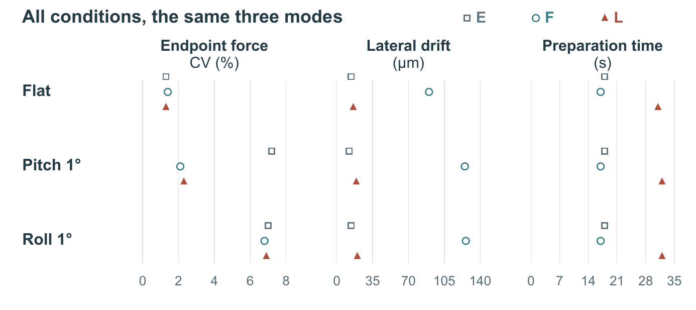

# 先贴合，再锁定

一张机制图解释操作，另一张结果图检验取舍。两图来自同一份公开教学材料，与 PaperCraft 的三页完整稿配套。**全部数值为构造数据，不是真实实验。**


**[机制图 SVG](selected/mechanism.svg)** · [原尺寸 PDF](selected/mechanism.pdf) · [完整图注](captions.md) · [可编辑源码](build.py)

## 为什么选这个构图

旧方案把 E、F、L 三个夹具并排，便于逐模式查状态；新方案让读者先沿 L 的两个状态理解“贴合时需要自由，加载时关闭自由”。三种模式的完整比较由下方短条带承接。物体的正面、顶面与侧面帮助区分压头、试样和固定下压板；它们不是测量 CAD。

所有视图重复的是同一套单轴夹具，不是两套装置。锁图标表示状态，未虚构夹具内部结构。视角示意且坡度放大，不能读取真实尺寸或压力场。旧方案更直接显示 E 的初始接触姿态，新方案把这部分交给方法文字；这是一次有取舍的改图。

[原材料](input/implementation.md) · [原方案与论文前后对照](https://github.com/zlsjtj/PaperCraft/tree/main/examples/clamp-timing/complete) · [首次成图](retained/first/mechanism.png)

## 结果图保留完整比较



行是三种试样条件，列是三项指标。模式同时用形状与颜色区分；坐标保持二维，全部 27 个指标值来自原始九行 CSV。图中垂直偏移只分开模式，不能当作物理量。没有原始样本或不确定性区间，不补画误差线。

[结果 SVG](selected/results.svg) · [结果 PDF](selected/results.pdf) · [CSV](input/results.csv) · [进入论文后的实际页面](https://github.com/zlsjtj/PaperCraft/blob/main/examples/clamp-timing/complete/selected/clean.pdf)

## 重建

需要 Python、ReportLab 与 Poppler。字体显式指定 Arial 及粗体；使用替代字体后应重新查看换行与标签。

```sh
python examples/lock-timing-story/build.py --out new-figures --font ARIAL_TTF --bold-font ARIAL_BOLD_TTF --pdftoppm PDFTOPPM
```

从本仓库根目录运行，将三个占位路径换成真实文件。输出目录必须尚不存在。默认生成全矢量 SVG/PDF、220 dpi PNG 和 160 mm 宽的 96 dpi 预览；构造数据不变。SVG 文字可编辑，显示依赖相应字体；PDF 嵌字。

两图在实际 Word/PDF 中按 160 mm 核对。首次图中的压头引线终点和图例形状已经修正；`retained/first/` 保留首稿。发布目录中的 `selected/` 是修后版本。此处是既有材料的开发案例与重建验证，不是未见任务盲测。
