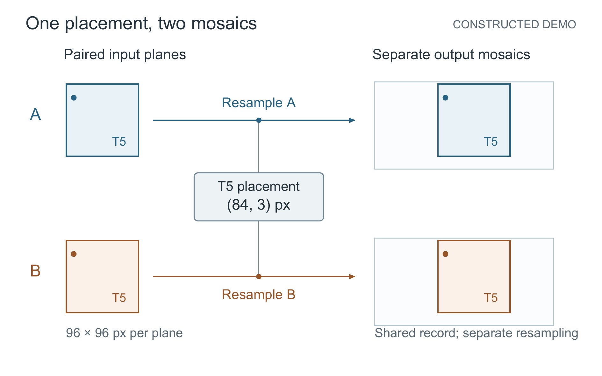

# 从安装包生成共同放置记录图



[SVG](figure.svg) · [PDF](figure.pdf) · [图注](caption.txt) · [构图说明](design.md)

输入是[两路图像的公开材料](../paired-placement/source/inputs/)。本次生成新的场景源码，采用两行对象对应及居中的共同记录；没有把旧成图当作重跑结果。首版有字号、穿线和文字对比问题，渲染后修正；失败记录保留在本地交付中。

在仓库根目录重建：

```text
python examples/multihost-first-use/build_trial.py --skill . --input examples/paired-placement/source/inputs --out ../figure-trial-source
python scripts/render_figure.py ../figure-trial-source/figure_spec.json --out ../figure-trial-output --font FONT.ttf --pdftoppm PDFTOPPM --qa-views
```

将占位参数换成实际字体和程序。图为全矢量示意，160 × 100 mm，最终最小字号约 8.50 pt。点代表说明材料给出的配对标记，不是模拟组织图像；平移和共享读取采用不同连线语义。技术检查通过，科学与视觉判断是维护模型复核，尚无作者认可。

这是当前维护上下文对已知教学材料的执行验证，不是独立新材料测试，也没有证明其他宿主已经能够完成任务。
