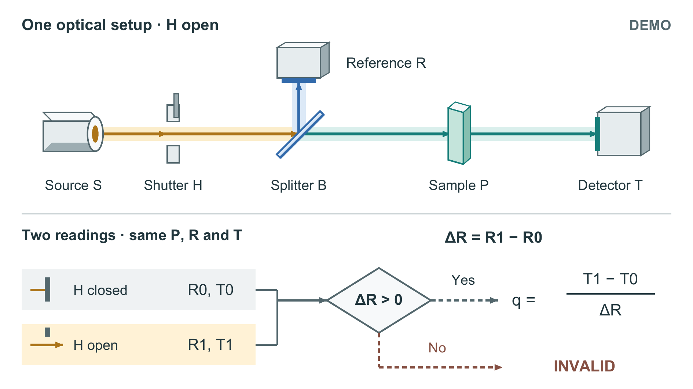

# 双通道透射读出教学示例

这是一次独立上下文试用产生的原创 DEMO。输入事实见 [任务书](input.md)。旧图没有原始文件，[旧图重建](baseline_reconstructed.svg)只复现任务书描述，不能称作原作截图。



新图以一套光学装置为共同参照，参考支路与穿过样品的测量支路在空间中分开；下方两行表示同一快门的状态，随后先判断参考差值，再决定是否除法。浅侧面区分样品、探测器和分光片，光路保持平面。颜色表示路径，不表示波长。图为 160 × 90 mm，最小标签 9 pt。

## 重建

从任意目录运行，显式填写本机真实路径。此脚本重建已写好的作品，不会读取新任务书后自行改写或选择构图。

```text
python /path/to/scientific-figure-studio/examples/optical-readout/rebuild.py --font /path/to/arial.ttf --bold-font /path/to/arialbd.ttf --pdftoppm /path/to/pdftoppm --brief /path/to/scientific-figure-studio/examples/optical-readout/input.md --skill-root /path/to/scientific-figure-studio --out /path/to/new-output
```

依赖为 Python、ReportLab、pypdf、Pillow、NumPy、Arial 常规/粗体和 Poppler。字体及原生工具不打包。固定作品重建仅使用 FigureCraft 的检查工具，不要求安装 PaperCraft；原始自然语言改写过程使用过 PaperCraft。输出目录必须新建或为空，没有覆盖开关。换字体要重新检查字符覆盖和排版，不能直接沿用当前结果。

## 过程与边界

首次作品的脚本写死了本机路径；发现后才参数化，并完成新目录重建及防覆盖检查。公开脚本进一步去掉了固定作品重建不需要的 PaperCraft 路径依赖；依赖哈希不再冒充技能加载记录。

四组数值都是构造输入。检查结果支持给定算术和无效状态处理，不支持真实准确度、绝对透射率或全面消除漂移。图注仍承担“不新增装置、颜色不表示波长”等必要解释；暗态光路没有单独完整展开。灰度和单一色觉模拟是有限代理查看，非真实打印、人类阅读实验或作者认可。
