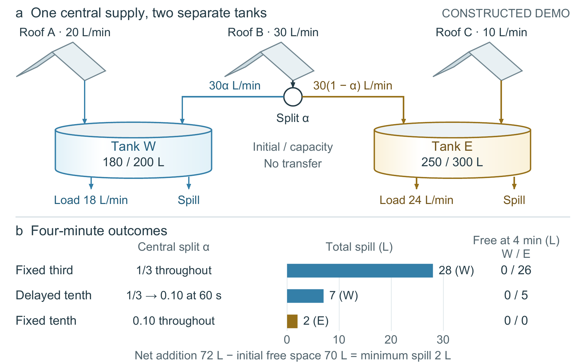

# 雨水分流：从抽象节点到对象轮廓

全部输入和结果均为 **CONSTRUCTED DEMO**，不是实测降雨、真实设施、控制算法创新或现场节水证据。本例记录一次开发修复及便携重建，**不代表独立首次生成成功**。

## 科学输入

`input/` 保存原始五文件：说明、未编辑段落、拓扑与操作记录、24行完整CSV、拒绝覆盖CSV的构造脚本。三条屋顶支路分别提供20、30、10 L/min；仅中央30 L/min经过单个分流器，按α和1−α进入两个不能互相转移水的储罐。各自负载和溢流出口独立。

四分钟内，固定1/3、60 s后改为0.10、全程固定0.10分别溢出28、7、2 L。净增加72 L而初始空余容量70 L，第三种设置达到2 L下界。容量、流率、时间和结果都来自声明的构造模型。

## 两种表示及选择



抽象节点版更简洁，物理类别主要靠文字辨认。对象版用相接屋面和曲面容器识别屋顶与储罐，保留单源互补分流、全部关系和同一结果面板。选择对象版的理由是对象更容易辨认；代价是线条更多，圆柱可能引起液位或容量比例联想。因此必须随图保留图注：**轮廓仅识别对象，不编码容量或水位**。若使用时会丢掉图注，抽象版的状态歧义较低。

独立模型审阅先看对象图，再读图注和全部原始材料，最后比较抽象图；未发现必须修复的科学、拓扑、单位或算术错误，倾向保留对象版。该比较不是匿名盲测或人类实验，也不是作者接受。审阅仍记录了液位联想、共享标签跳读和 `Free` 用词的潜在歧义；未将其改写成已发生的人类误读。此处只保留摘要，不打包内部评阅全文。

## 保存的阶段

- `figures/abstract-first/`：首次抽象图；当时五处文字对比度检查失败，历史产物未覆盖。
- `figures/abstract-baseline/`：加深文字后的抽象基线，亦为 `baseline_spec.json` 对应版本。
- `figures/object-first/`：首次完整对象候选，罐顶仍使用对应角色色。
- `figures/object-selected/`：选定版；罐顶改为中性外表面，减少满水暗示。

每阶段保留SVG、PDF、PNG、规格和图注。图宽160 mm、高99.56 mm，最小字号约9.07 pt；定量条形始终为二维。`comparison.png` 为前后概览，不替代原尺寸PDF。`artifact_provenance.json` 记录原始输入及历史图件哈希。

## 在仓库中重建

依赖Python 3、reportlab、pypdf、Pillow、numpy、FigureCraft的 `scripts/` 与 `assets/`、Poppler `pdftoppm`，以及合法可用的Arial字体。字体不随案例分发；换字体可能改变度量，必须重新核验。SVG使用原生文本和矢量对象，PDF嵌入字体。

本目录可整体移动。若安装于仓库的 `examples/rainwater-routing`，从该目录运行，输出目录必须尚不存在：

```powershell
python -B build_developed.py --skill ../.. --out rebuild-selected --font <Arial字体文件> --pdftoppm <pdftoppm可执行文件> --opaque-exterior
python -B verify_rebuild.py --candidate rebuild-selected --skill ../.. --out rebuild-result.json
```

也可在另一工作目录以完整脚本路径运行；原始输入和基线默认相对脚本定位。省略 `--opaque-exterior` 可重建对象首候选。抽象阶段可用仓库 `scripts/render_figure.py` 直接渲染各自 `figure_spec.json`，同目录CSV已绑定。

`build_developed.py` 的公开包装仅添加相对默认路径、相对来源引用及去宿主路径的运行记录；不修改科学数据、图元或设计。便携重建与选定历史图的PNG像素、PDF文本及绘制内容比较见 `verification/rebuild-result.json`。重建只是确定性复现，不是新的自然语言创作试验。公开目录不含用户风格参考图、私有评阅答案、其他论文或绝对宿主运行日志。
