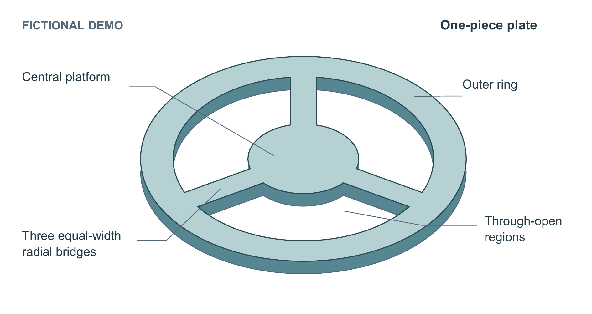

# 一体环桥板：新材料迁移试用

输入见 [source_input.md](source_input.md)。中央圆台、完整外环及三条等宽等间隔径向桥是一块连续材料，桥间三处贯通空隙，没有载荷、流动、实测尺寸或其他装置。全例为原创虚构 DEMO。



执行者在新上下文中只收到原始材料、目标、候选技能与运行条件，没有收到旧作品、预定构图或审阅答案。先画俯视，再画斜视，一次自主修复后保留选用图；没有按评审结果反复挑最好的一次。

| 方案 | 收益 | 代价与选择 |
|---|---|---|
| 俯视 `first_draft/` | 三桥连接与开口边界最直接 | 厚度只能靠图注说明。保留首稿。 |
| 斜视 `oblique_first_draft/` | 同一轮廓体现连接与均匀厚度 | 初稿有表面接缝，容易把同一材料误读为拼接。 |
| 选用 `selected/` | 去掉共面接缝，深浅面归属于同一对象 | 两条长引线跨过其他区域，图形仍偏工程示意；没有声称审美全部达标。 |

最终源码拓扑检查得到1个材料连通域、3个开口。代理审阅读出了这些关系；精确角度、宽度不靠位图审阅认证。标签检查保留 `REVIEW_REQUIRED`，不能用检查器代替视觉判断。本例没有普通提示/旧技能对照，不证明新版胜率或稳定性。

## 从源码重建

```powershell
python -m pip install -r examples/ring-bridge/requirements.txt
python examples/ring-bridge/build_figure.py --out ring-output --view oblique --font C:/Windows/Fonts/arial.ttf --bold-font C:/Windows/Fonts/arialbd.ttf --pdftoppm <pdftoppm.exe完整路径>
python examples/ring-bridge/build_pages.py --out ring-pages
```

在仓库根目录运行，输出目录须不存在。`--view plan` 生成俯视。输出SVG/PDF/PNG、英文段落/图注JSON、灰度和一种色觉模拟。对象全部是可编辑矢量，160×85 mm，9–10 pt；字体是外部依赖。源码在异目录重建时，SVG/PDF/PNG/JSON哈希一致。

页面脚本从归档的选用图和 `document-input.json` 构建两份Word；变更图源后须更新绑定。Word转PDF另用宿主文档渲染器。已生成 [清稿 PDF](documents/clean.pdf)、[审阅稿](documents/review.docx)，各1页。黄标相对俯视首稿的文字，只高亮改动图注，不是原生修订。
