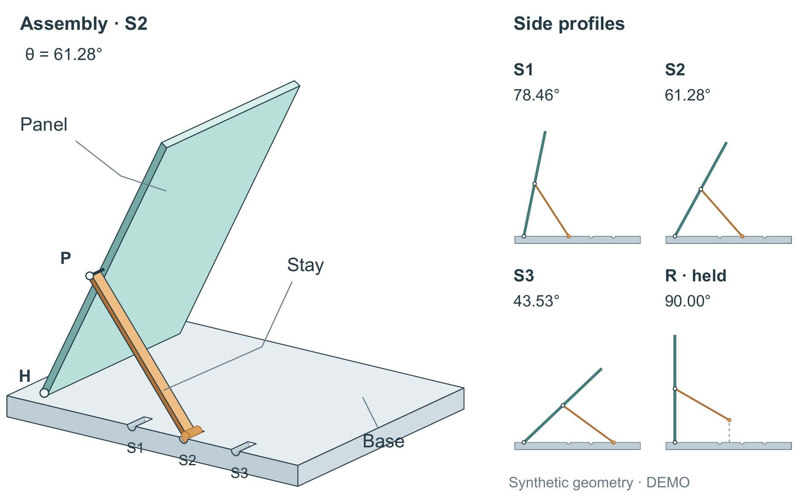

# 可释放支架：凹槽遮挡的完整修复例

这份原创教学 DEMO 的新上下文生成只收到未整理正文、几何说明和四行解析状态，没有收到主旨或构图答案。全部数值是构造几何，零原型、零实验。`final.md` 先说明两永久连接与可释放接触，再给必要尺寸和四个状态；完整原始材料在 `source-input/`。

## 同一几何，哪里表现错了



初次生成加一次自审后的 `before/` 已能识别三个实体和三档/释放状态，但仍把应被底座遮住的槽/脚内表面绘在顶面前方。独立模型先看作品，再核对规范与SVG，并给出射线反例。凹槽因此像附加小管，问题影响核心关系，不能靠图注写“凹槽”补救。

选定版 `selected/` 保留全部模型尺寸、轴坐标、四个同尺度侧视、文字和图注。先画槽内曲面，再让实体表面遮挡；脚近端面按视线穿出槽口或被实材挡住的可见区域裁切。没有一刀抹掉整个下半脚：真正露出的近端下部仍然保留。两个永久铰链没改，H标记靠近真实轴位，Stay引线进入杆面。

独立复核纠正了初判：旧Stay引线已接触杆描边，H也有短轴，二者并非确认的拓扑错误；只是视觉归属较弱。必须修的只有可见表面错误。前后源码均保留，修后属于评后开发，不是独立首次通过。左侧板面占比仍较大，关键接触在160 mm入稿时较小；不能由本例声称审美已经稳定达到顶刊标准。

## 重建

需要Python、reportlab、pypdf、Pillow、numpy、Poppler与合法可用的常规/粗体字体。字体不随包分发。当前目录运行，输出须不存在：

```powershell
python -B build_figure.py --out rebuilt --font <Arial路径> --bold-font <Arial粗体路径> --pdftoppm <pdftoppm路径> --revision final
```

旧版用 `build_figure_before.py` 和相同参数重建。源码默认读取相对 `source-input/finite-record.csv`。SVG、PDF均可编辑矢量，PNG为300 dpi，图宽160 mm、高99 mm；灰度及一种近似绿色盲模拟随图提供。`--revision final` 不可省略：源文件还保留历史绘制分支，默认分支不是本次选定图。

遮挡修复是本例在固定投影下的明确可见性计算，不是通用三维渲染器或全曲面科学正确性证明。可复用的是把实体、空腔和观察射线对齐的做法；不要复制本支架坐标到其他题材。独立模型定向复查、源码重建、Word/PDF显示、人类认可分别记账。未做真实打印、人类审美测试或作者接受。
