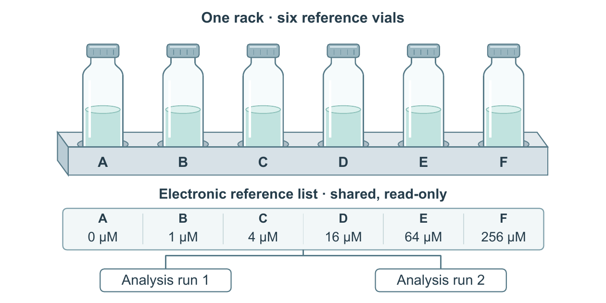

# 一架六瓶与一份共享清单

原创教学 DEMO；没有实验测量，也不是设备尺寸图。`input.md` 是实际生成任务，`references.json` 保存六组浓度。执行者仅收到原材料、输出约束和冻结技能，在新上下文生成；首次自修保留首图；独立审阅指出底部约1mm留白后，将两框和分支上移2mm。first/保留初版，selected/为修复版，不把评后精修当首次生成表现。

对象关系由三种画法分工：轮廓、遮挡和浅侧面让瓶架可辨认；等距槽位对应 A–F；电子清单记录不等距浓度，两次分析以无向连接引用同一清单。液面和液色相同，不作为浓度的另一个编码。局部几何是矢量2.5D示意，不表示真实三维测量。



## 重建

在本目录运行，替换字体与 Poppler 路径；新输出目录必须不存在：

```powershell
python -m pip install -r requirements.txt
python build_figure.py --data references.json --out new-rack --font <Arial.ttf> --bold-font <Arial-bold.ttf> --pdftoppm <pdftoppm.exe> --revision final
```

源脚本没有个人绝对路径；SVG的字和图元可分别编辑，PDF为含字体的矢量输出，PNG由PDF渲染。160×80 mm，文字9.5–11 pt。已经在换目录后重建，三种主文件逐字节一致；这证明固定源码可重建，不证明从任意自然语言都能自动生成同样质量。

本例使用自有原生绘图代码，没有调用通用关系组件，不能拿它验证关系接口的自然采用率。正常色、灰度和一种色觉模拟已经由模型查看；独立SVG应用显示一致性、原生Word、打印和作者接受未验证。评后版底边距约3mm；首轮留白问题和独立审阅记录均保留。其他例子仍可采用不同构图，不应把本例套成通用三层模板。
