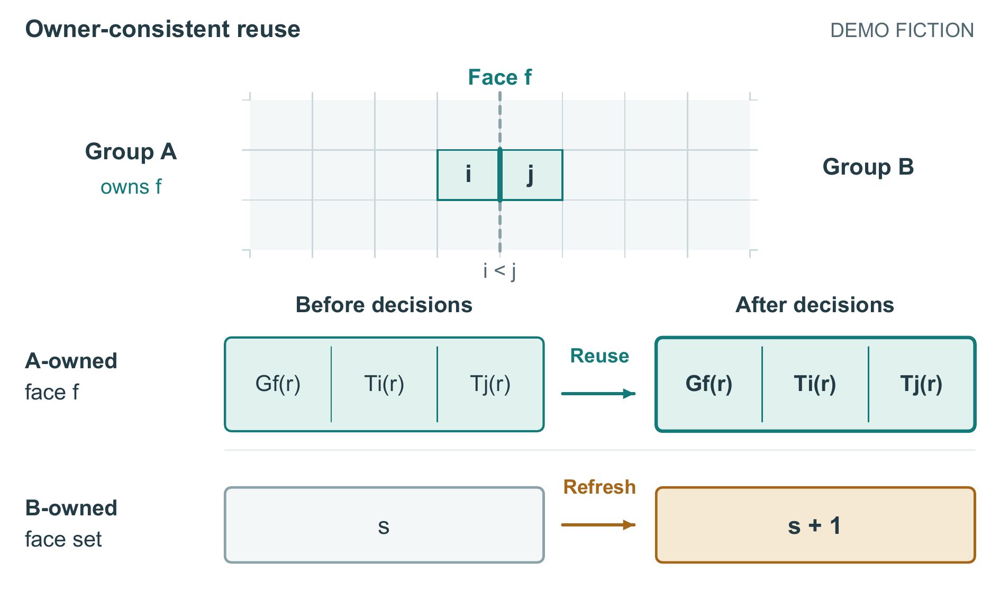

# 同一记录跨状态保留

本例是完整热传输论文的机制图开发，全部为DEMO FICTION。没有真实求解器、温度轨迹、硬件时延或新颖性证明。图只解释材料明确提供的逻辑关系，不模拟热流。

一个跨组面f由A拥有；其系数Gf和两端点温度快照Ti/Tj属于A的同一次刷新r。A保留该系数时，B可以把自己拥有的面集从刷新s推进到s+1，但不能覆盖A保存的两个快照，包括描述B中端点j的那个。i<j决定所有权。网格为16×16组的局部裁切；缓存位置是逻辑排布，不表示物理空间。两份前后视图表示同一记录，不是两份存储。

## 方案与代价

旧图用共享边界和缓存框，并在顶部和底部用长句说明规则。首个新方案把同一记录的前后视图对齐，同时展示B的更新；另一个方案只显示一个A记录，用三条无向虚线绑定端点和系数。两者保留在`first/`，并非事后捏造对照。

选中前后状态方案，原因是A不变、B改变可沿同一列关系核对，不必先读一条完整禁止性规则。代价是重复显示同一记录，需要图注明确不是重复分配；单记录方案保留了直接端点绑定的优势，但长虚线和括注使读图依赖较多解释。当前图仍是逻辑示意，不因去掉长句便自动达到期刊插图审美。

当前160×96mm、9–11pt；旧图160×104mm。高度调整单列，不能用缩小画面本身证明改善。颜色区分保留/更新，形状和相同刷新标识也承担关系。状态箭头不表示热流；定量结果保持单独二维图。



## 重建

```powershell
python -m pip install -r examples/snapshot-state/requirements.txt
python examples/snapshot-state/build_figure.py --out snapshot-output --font C:/Windows/Fonts/arial.ttf --bold-font C:/Windows/Fonts/arialbd.ttf --pdftoppm <pdftoppm.exe完整路径> --stage final-a
```

输出目录必须不存在。`--stage first`可重新生成两个原始组织候选；`build_first.py`保存当时首稿实现。SVG和PDF均为全矢量，PDF嵌入字体子集，SVG依赖本机Arial或等效字体；PNG为300dpi。灰度和一种色觉模拟供辅助查看。脚本校验字体/边界和导出，不自动判断科学含义与美感。

生成执行者在完成图后遇到模型服务容量错误，未完成最终说明文件；维护者接续核对、归档和文档整合。技术可重建、开发审阅、新材料生成和作者认可分别报告。完整论文由PaperCraft的`examples/heat-story`承接，其中`build_snapshot.py`是本例生成器的固定副本；维护时同步核对文件哈希。公开来源材料均为原创构造，不含用户视频或参考截图。

发布文本统一LF换行；历史构建收据保留当时原始字节标识，当前包另有安装哈希。热稿图2 PDF含生成时间，重建比较其绘制流、文字、SVG及PNG；不要求带时间元信息的PDF字节相同。
