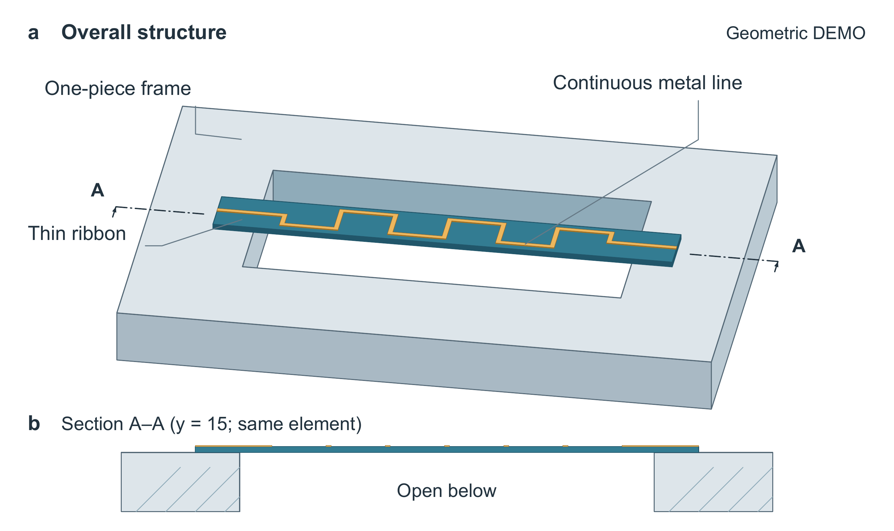

# 悬桥结构：单视图与带剖面的真实取舍

原创几何DEMO，没有器件用途、测试结果或物理性能。输入只给三种实体的坐标、接触、通孔和金线，不给构图答案；见[input.md](input.md)。旧、新技能在两个独立上下文中使用同样材料和160×95 mm输出要求。每个执行者保留第一份完整产物，再做一次自主修正。

| 方案 | 优点 | 代价 |
|---|---|---|
| old-final 单视图 | 四个标签归属直接，视觉更凝练，一眼看完整体 | 下方是否敞开仍需结合通孔标签 |
| new-final 整体加同源纵剖 | 两端接触、中部悬空、无底板可以直接看见 | 金线长引线更明显，剖面金色短段需要理解 |
| selected 反馈修复 | 在上述构图中补A–A端标，主图与剖面能直接对应 | 多两个标准端标，不能称字更少或全面更美 |

匿名独立模型先看图、后看图注；略偏好新版的结构解释，也指出旧版更统一。新稿最初没有标剖切位置，因此评语后的selected另存源码与图注，未倒写成首稿已完成。这里只验证一次未知材料的有限迁移，没有普通提示组、严格算力配额、重复采样或真人审美认可。两张主视图的完成度接近，不宣称审美全面胜出。



## 文件与重建

[清稿](document/clean.docx)、[PDF](document/clean.pdf)、[黄色稿](document/review.docx)、[审阅PDF](document/review.pdf)。图片变更看实际对照，黄色仅标文字；不是原生修订。SVG/PDF为全矢量，Python保留坐标、投影、标签及剖面交点，图中的三种实体不因局部重复而增加。

在仓库根目录、使用新输出目录运行：

```powershell
python examples/suspended-ribbon/build_figure_reviewed.py --geometry examples/suspended-ribbon/geometry.json --out bridge-rebuilt --revision 1 --font C:/Windows/Fonts/arial.ttf --bold-font C:/Windows/Fonts/arialbd.ttf --pdftoppm /path/to/pdftoppm
python examples/suspended-ribbon/build_document.py --image bridge-rebuilt/figure.png --title "A continuous ribbon over a through-opening" --body examples/suspended-ribbon/manuscript-paragraph.txt --caption examples/suspended-ribbon/caption-selected.txt --out bridge-rebuilt/clean.docx
```

生成依赖NumPy、Pillow、ReportLab、pypdf及Poppler；Word页另需python-docx。字体不随包发布。旧图可用generate_old.py加--input input.md及相同字体/导出参数重建；build_figure.py保留新版首轮程序。

独立技术检查核对实际图元、截面交点、字体、尺寸与嵌入图。附带第三方PDF审计器不支持本例ASCII85+Flate压缩，失败保留；实际字号另由pypdf解码检查，不能把该工具标成通过。SVG复杂背景审计为REVIEW_REQUIRED，PDF渲染由模型查看。未验证原生Word、真实打印、全部色觉条件或作者认可。
